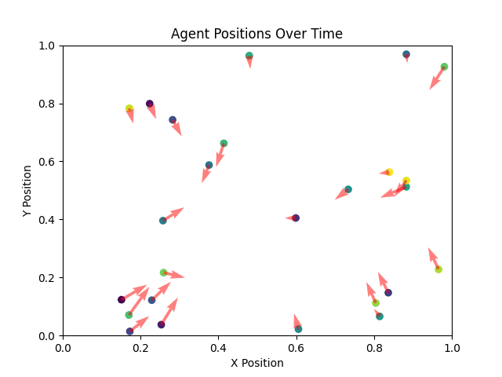
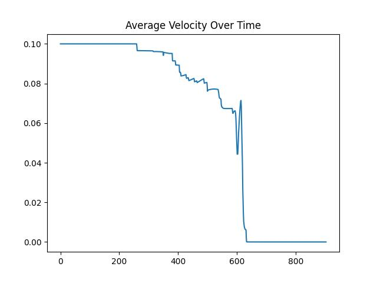
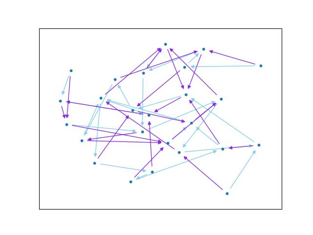
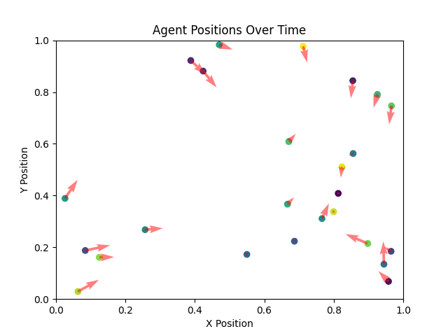
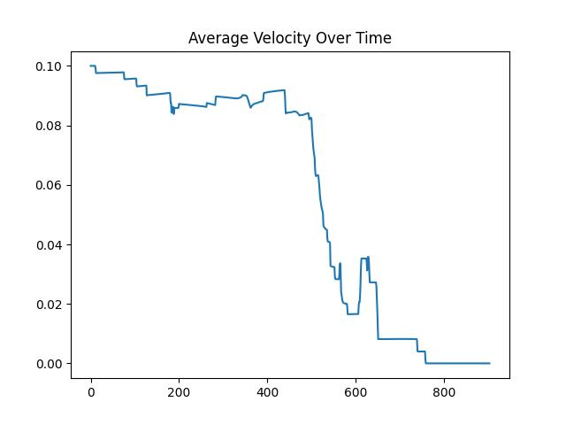
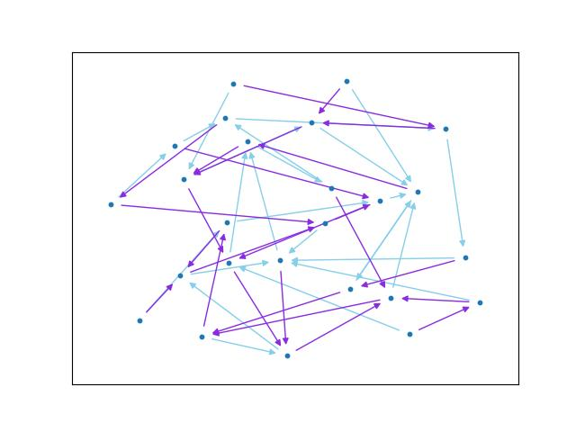
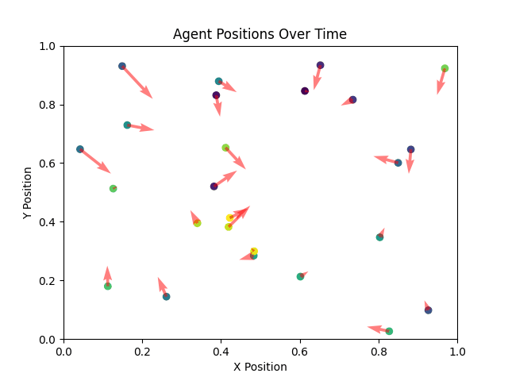
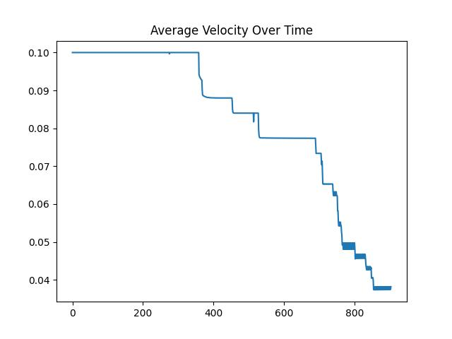
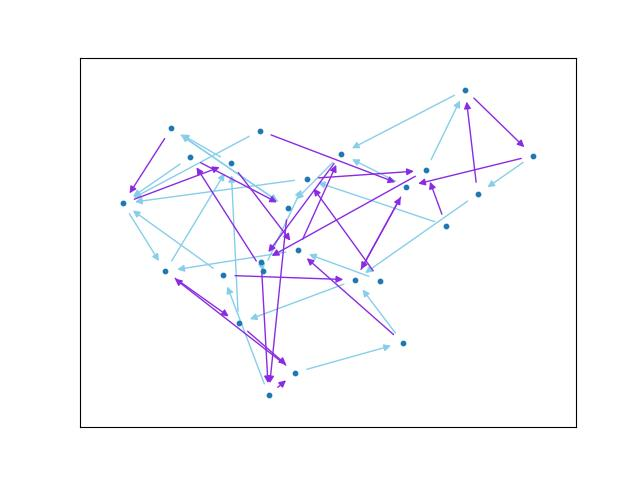

---
author:
- Jakob Galley, Viktor Vigren Näslund
date: April 2025
title: WASP AIML
---

# Introduction

In Örebro, we did a human swarm experiment.
Participants had to choose targets based on some distrubition and had to find a way to fulfill their task in the room.
In that problem setting there are underlying biases as target distribution, speed and perception of the participants.
But nevertheless, after some time, we all arrived at some kind end state.
This state was mostly static, but in one task (cf. task(b)), we a got a dynamic periodic end state.

The aim of this exercise was to study and maybe repdroduce the insights gathered in the human swarm experiment.
By modelling this problem with a computer, we can change parameters as number of agents or velocity more freely.
It will fail to modell humans exactly but gives a way to do multiple experiments in a short time with  parameters which we cannot fathom to do in the real world.

# Problem setting

Develop a simulation of the human swarm exercise in a programming
language of your choice. Can you reproduce the overall behavior patterns
that we observed during the experiment? Analyse convergence and
sensitivity of the swarm behavior to different parameter settings, such
as perception radius, heterogeneity of speed, etc. . Assume that the map
is free of obstacles. The simulation should reproduce the following
positioning scenarios:

1.  Every agent $X$ selects two other agents randomly: $A$ and $B$ (and
    memorizes them). During the experiments agent $X$ always tries to
    position itself between $A$ and $B$. Every agent does the same.
    Decision making of the agents must be strictly local.

2.  Initial setup is the same as in a. The difference is that $X$ now
    tries to position itself so that $B$ is between $A$ and $X$ ( $X$
    hides behind $B$, so that $A$ cannot attack/see\...).

3.  Would anything change if agents are allowed to communicate? Can you
    imagine a scenario in which communication would be important?

Prepare a report documenting your model(s) as well as giving details of
your simulator.

# Code presentation

We decided to code our simulator in Python because of familiarity, ease
of use and flexibility. As the logic of our agents is not to complicated
we calculated their decision and updated their position globally. Thus,
we only have an environment class which holds the necessary functions
for initialization and updating. Furthermore, we have outside help
methods for target generation, goal calculation and plotting.

## Environment class

On initialization, we have to give this class the number of agents, the
goal calculator function and a target generator. Furthermore, we can
change the timestep size dt and the perception radius. We store these
parameters and initialize random positions for our agents which we store
as an array. Also, the agents speed is initialized as the shift of the
absolute value of an Gaussian array.

In the update method, the agents position gets updated based upon the
goal function, perception radius and timestep size. If the target's
position is outside of the perception radius, then the last memorized
position is used for goal calculation. For the goal calculation, we use
the passed goal calculation function. This function should return the
goal positions for our agents as an array. Then, our agents move towards
these positions as far as possible depending on their speed and the
timestep size.

Here is the pseudo-code: Calculate the distance between the goal
positions and the agents positions 

$$
\begin{aligned}
    \text{diff} &= \text{goal\\_pos} - \text{old\\_pos}\\
    \text{dist} &= \lVert \text{diff} \rVert.
\end{aligned}
$$ 

Then, we update the positions based upon the distance is
reachable within the time step in the following way:

$$
    \text{new\\_pos} = \begin{cases}
        \text{goal\\_pos} & vdt \leq \text{diff} \\
        vdt/\text{dist} \cdot \text{diff}  & vdt > \text{diff}
    \end{cases}
    $$

Then, there is also a small function which returns the average velocity
between each time step using the last and new position of the agents.

## Goal calculation

We use a between_goal calculation function which gets passed to the
position of the agents, the targets positions and a string to decide the
goal method. As an output, we return the goal positions of all the
agents as an array.

We have the following options for goal calculations:

**\"midpoint\"**:  the goal is to position oneself in the middle between
    both targets.

$$\text{goal\\_pos} = \frac{1}{2}\left(\text{target1\\_pos} + \text{target1\\_pos}\right).$$

**\"inbetween\"**:  the goal is to position oneself on the closest point
    in the line segment between the targets. For that, we calculate
    scalar projection of our vector onto the line and then by checking
    mininima and maxima with regards to $0$ and $1$, calculate the
    nearest point in the line segment. The pseudo code looks like this:
    Calculate the scalar projection:

$$      
\begin{aligned}
    \text{dir} &= \text{target1\\_pos} - \text{target2\\_pos} \\
    \text{norm} &= \lVert \text{dir } \rVert \\
    s &= \langle \text{pos}- \text{target2\\_pos}, \text{dir} \rangle /\text{norm}.
\end{aligned}
$$
    
Then the nearest point on the line segment is given
by 

$$\begin{aligned}
        t &= \max\\{\min \\{s, 1\\}, 0\\}\\
        \text{goal\\_pos} &= \text{target2\\_pos} + t\cdot \text{dir}.        
\end{aligned}$$

If the norm is $0$, we get a division by zero. In
this case both targets are on the same point, so just try to get to
this point.

**\"tailgating\"**: the goal is to position to oneself to the closest
point in the line behind target2. This is similar to \"midpoint\"
with the difference being in the possible line parameter we are
looking for ($(-\infty, 0]$ instead of $[0, 1]$). 

$$
\begin{aligned}
        t &= \min \\{s, 0\\}\\
        \text{goal\\_pos} &= \text{target2\\_pos} + t\cdot \text{dir}.
\end{aligned}
$$

## Target generation

First, we thought that every possible target system can be explained
through cycles and agents who are not part of these cycles but have one
or more targets in a cycle. That is why first generated a method to
generate cycles and a method for singletons who target agents in these
clusters. Then we noticed that this assumption is flawed and just
created a random target generator method. Here we used some clever
modulo arithmetic to guarantee that every agent has two different
targets and does not target themself.

We set up the identity array as

$$I = [0, 1, \ldots, \text{n\\_agents}-1].$$

Then, if we add a random
integer array with values between $1$ and $\text{n\\_agents}$ and take
the result modulo $\text{n\\_agents}$, we cannot get the identity:

$$
\begin{aligned}
    \text{shift1} & = \text{randInt(1, n\\_agents)}\\ 
    \text{target1\\_pos} &\equiv I + \text{shift1}  & \text{mod n\\_agents}.
\end{aligned}
$$ 

For the second target, we need to guarantee a new shift
between $1$ and $\text{n\\_agents}$ which is different to $\text{shift1}$
at every position. We used the same trick as above, but with modulo
$\text{n\\_agents}-1$ to guarantee a new shift. Because we need to $1$ at
the end, the random integer array is allowed this time to take values
between $0$ and $\text{n\\_agents}-2$. Note here, that an addition of
$\text{n\\_agents}-1$ corresponds to subtracting $1$ in modulo arithmetic
which becomes $0$ when adding $1$ at the end. Thus 

$$
\begin{aligned}
    \text{shift2} & = \text{shift1} + \text{randInt(0, n\\_agents-2)} &\text{mod n\\_agents}\\ 
    \text{shift2} & = \text{shift2} +1 &\\
    \text{target2\\_pos} &\equiv I + \text{shift2}  &\text{mod n\\_agents}.
\end{aligned}
$$

## Animation/Plotting

# Experiments

## Task (a)

In task (a), we considered the \"in-between\" and \"mid-point\" goal
calculation method, which try to place the agents either on the nearest
point of the in-between-line of the target agents or in the middle. In
both cases, results seemed to coincide differing only in the speed of
convergence.

Indeed, in all our experiments the system converged to stable state.
These states are characterized by non-moving agents usually huddling
together, forming clusters and converging to single points. 
Inbetween these clusters, lines can form (cf. 200 agents in the section on perception radius).

In some cases the end results was a little bit dynamic, but this is can be
attributed to step size of the agents.

The following example is of 25 agents which use the midpoint calculation:

 

The following example is of 25 agents which use the inbetween calculation:

In both examples, some clusters seem to form quickly with other agents joining after.
We believe that these first clusters collapses are due what we call minimial dynamical systems.
These are minimal subsets of agents which are closed under the choice of targets.

## Task (b)

In task (b), we considered the \"tailgating\" goalcalculation method, which tries to place the agent to the closest point on the line behind target agent 2.
Suprisingly, this resulted into a similar behaviour as in the other task with some occurences of dynamical periodic end states.

We expected a lot more of these periodical end states but maybe due to our goal calculation method, these didn't arise as often as anticipated.

The convergence process can be very different though.
We see a lot of lines forming after slower agents which then follow these slower agents until either everything collapses to points or they form a cyclic periodic shape.
The latter one can be somewhat attributed to the stepsize.

The following example is of 25 agents which use the tailgating calculation:

Note how the end velocity is not $0$ - the agents are fluctuating near a point.

Here is a more clearer example of a periodic shape forming.
At the end, it will probably converge to a point, but in a more realistic setting, this would be a periodic pattern.

# Influence of parameters

## Percpetion radius

The perception radius can influence the simulation quite a lot.
The agents tend to move towards the middle because of initialized memory.
But then, they and only become active as soon as their targets come into field of vision.
When this happens it can trigger a chain reaction with other agents becoming active as a result of the agent moving.
Overall, the end state becomes more cluttered.

Have for example a look at these simulations (full perception, 0.5, 0.2, 0.0001) with 200 agents for the inbetween method

and here is how the spread influences the simulation (mean=0.2, std=0.1/0.2/0.3/1.0)

We get a lot more active agents, but some less perceptive agents still get lost.

And for the tailgating method, we see similiar results:

And this is how the spread influences the simulation (std=0.1, 0.2, 0.3, 1.0 with mean=0.2)

## Velocity

Changing the mean just changes the speed of convergence, so it is more interesting to look how the spread of the velocity impacts the simulation.
Here is an example, where the velocity drops from 0.1 to 0.01:

When we change the spread of the overall velocity, then there exist now some agents who are faster than others.
These agents we move more quickly to their target location and might have to wait for their slower targets to move.

And we can see the same in the case of task (b)

and spread

# Appendix: Mathematical formulation

## Task (a)

The start setting of our problems can be modelled as simple direct
graphs where the set of vertices $V$ is the set of agents and two
vertices $v_1$ and $v_2$ are connected by edge $e$ in direction $v_1v_2$
iff $v_1$ has $v_2$ as its target agent. We will denote by $E$ the set
of all directed edges.

For a vertex $v$, we will denote by $\deg^+(v)$ the *outdegree* and by
$\deg^-(v)$ the *indegree* of the vertex $v$. In our case $\deg^+ = 2$,
and thus

$$2\cdot|V| = \sum_{v\in V} \deg^+(v) = \sum_{v\in V} \deg^-(v) = |E|.$$

We call $V'\subseteq V$ a *dynamical system* if the induced subgraph can
be modelled as a result of the same problem setting, i.e. the induced
subgraph is only depended on itself. This is equivalent to the following
easy criteria

$$2\cdot |V'| = |E(V')|.$$

We can the sets of dynamical
systems with the set order $V_1 \leq V_2$ iff $V_1 \subseteq V_2$. We
call $V'\subseteq V$ a *minimal dynamical system* if it is minimal with
regards to this order.

Let us consider the free $\mathbb{R}$-vector space $F(V)$ of $V$, which
has as elements finite formal sums of the following form

$$y = \sum_{v\in V} \lambda_v v$$ 

with $\lambda_v\in \mathbb{R}$. There is a canonical embedding $\phi$ of $V$ into $F(V)$ given by
$\phi(v) = 1v$. Furthermore, if, as in our case, $|V|<\infty$, then
$F(V) \simeq \mathbb{R}^{|V|}$

For a directed graph $(V, E)$ we can also define an adjacency matrix $A$
with 

$$
A_{vw} = \begin{cases}
        1 & wv \in E \\
        0 & \text{else}.
    \end{cases}
$$
    
Note that for a dynamical subsystem of
$V'\subseteq V$, the induced adjacency matrix is just the restriction of
$A$ to $V'$. Furthermore, if $V$ is a minimal dynamical system, then the
row and column sum of $A$ is $2$. Note that $A$ can be viewed as a map
from $V$ into $F(V)$ which maps $w$ onto the sum of $v$'s with
$vw\in E$. This map extends then uniquely to a linear map from $F(V)$
onto itself given by 

$$Ay = \sum_{v, w\in W} A_{vw} \lambda_w v$$

Each vertex $v$ in $V$ has a position feature $x_v\in \mathbb{R}^2$.
This map extends uniquely as a linear map on $F(V)$ given by

$$x_{\sum_{v\in V} \lambda_v v} = \sum_{v\in V} \lambda_v x_v.$$

So $x$ can be viewed as a matrix of the form $\mathbb{R}^{2\times |v|}$. As a
result, $x$ behaves nicely with linear transformations of $F(V)$

$$x_{Ty} = \sum_{v, w\in V} T_{vw} \lambda_w x_v = Tx_y$$ 

for any $y\in F(V)$.

We write $x_V = (x_v)_{v\in V}$ as the vector containing the canonical
basis of $F(v)$.

In task $(a)$ we would like to minimize the following goal function

$$\mathcal{E}(x_V) = \sum_{v\in V} \left\|x_v - \frac{1}{2}x_{Av} \right\|^2 = \sum_{v\in V} \left\|\left(I - \frac{1}{2}A\right)x_v \right\|^2$$

with the start position of all the vertices of $V$ given by a matrix
$X_0$ 

$$x_V(0) = X_0.$$ 

This minimization problem corresponds to the gradient flow equation 

$$\partial_t x_V(t) = - \nabla\mathcal{E}(x_V).$$

The derivative of $\mathcal{E}$ is given by
$\nabla\mathcal{E}(x_V) = \left(2I - A - A^T + \frac{1}{2}A^TA\right) x_V$.
By setting

$$T = 2I - A - A^T + \frac{1}{2}A^TA = 2\left(I-\frac{1}{2}A^T\right)\left(I-\frac{1}{2}A\right),$$

the uniquely solution of the Gradient Flow is given by

$$x_V(t) = X_0 \exp(-tT).$$ 

Note that for a minimal dynamical system,
the matrices $I-\frac{1}{2}A$ and $I-\frac{1}{2}A^T$ are positive
semi-definite as the diagonal is $1$ and the sum of rows and columns is
always $0$. In particular, $T$ has only eigenvalues which are greater or
equal to $0$. As a result, $\exp(-tT)$ behaves as a constant matrix as
$t\to \infty$ and there exists a unique constant end state
$x_V(\infty)$.

This end state must be a collapse of all points to one point. In this
way all minimal dynamical systems are classified.

In our similation, we don't use gradient descent, so this mathematical result has on limited application.
